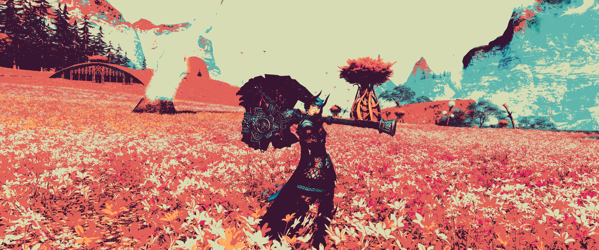
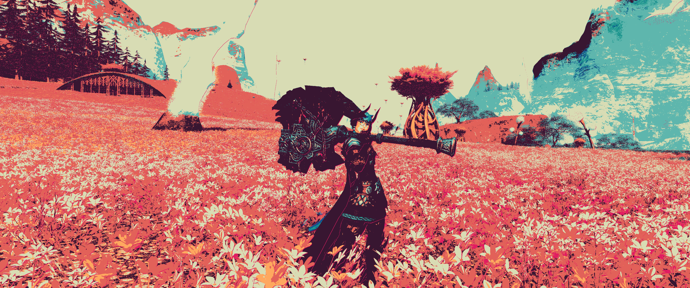

# Destrea FX
A pair of modular post processing shaders built for ReShade, intended for use with Final Fantasy XIV gameplay and GPose.

For an installation and setup walkthroughs, refer to the [wiki]().

## Example Screenshots
  
  
  
  

References:  
https://github.com/crosire/reshade-shaders/tree/slim/Shaders  
https://en.wikipedia.org/wiki/Sobel_operator  
https://www.youtube.com/watch?v=gg40RWiaHRY  
https://lettier.github.io/3d-game-shaders-for-beginners/posterization.html  
https://lospec.com/palette-list/vividmemory8  
