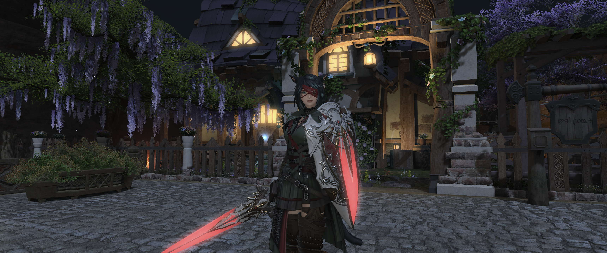
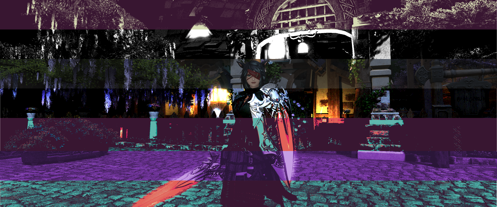
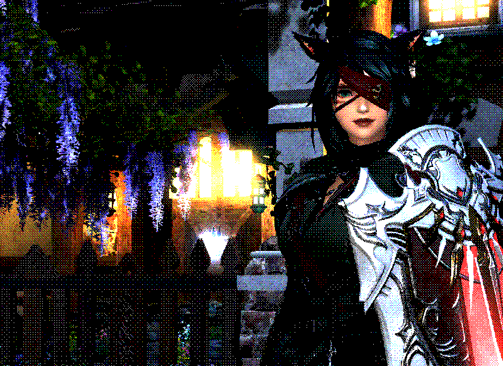
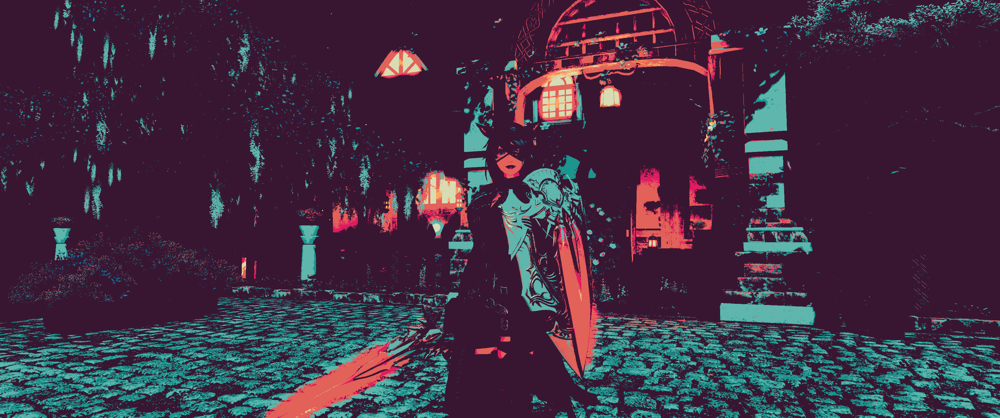
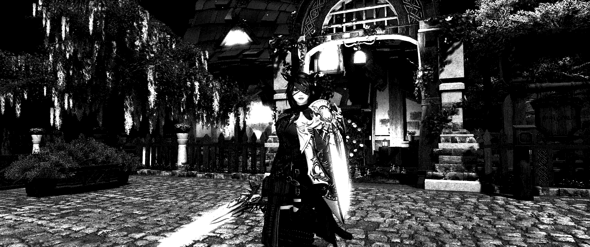

# DestreaFX
Modular post processing shaders built for ReShade, intended for use with Final Fantasy XIV gameplay and GPose.

For installation and setup walkthroughs, refer to the [wiki]().

## Example Screenshots

### Dithering Shader
#### Original Image
  
#### Comparison
  
#### Close-up 3Bit RGB
  
#### Color palette-swapped
  
#### 2-Tone Black and White
  

### References:  
Joel Yliluoma's dithering algorithm: https://bisqwit.iki.fi/story/howto/dither/jy/  
Normal-map generation from DisplayDepth.fx: https://github.com/crosire/reshade-shaders/tree/slim/Shaders  
Sobel Operator: https://en.wikipedia.org/wiki/Sobel_operator  
General Edge-detection ref: https://www.youtube.com/watch?v=gg40RWiaHRY  
Color Posterization: https://lettier.github.io/3d-game-shaders-for-beginners/posterization.html  
Default Color Palette: https://lospec.com/palette-list/vividmemory8  
